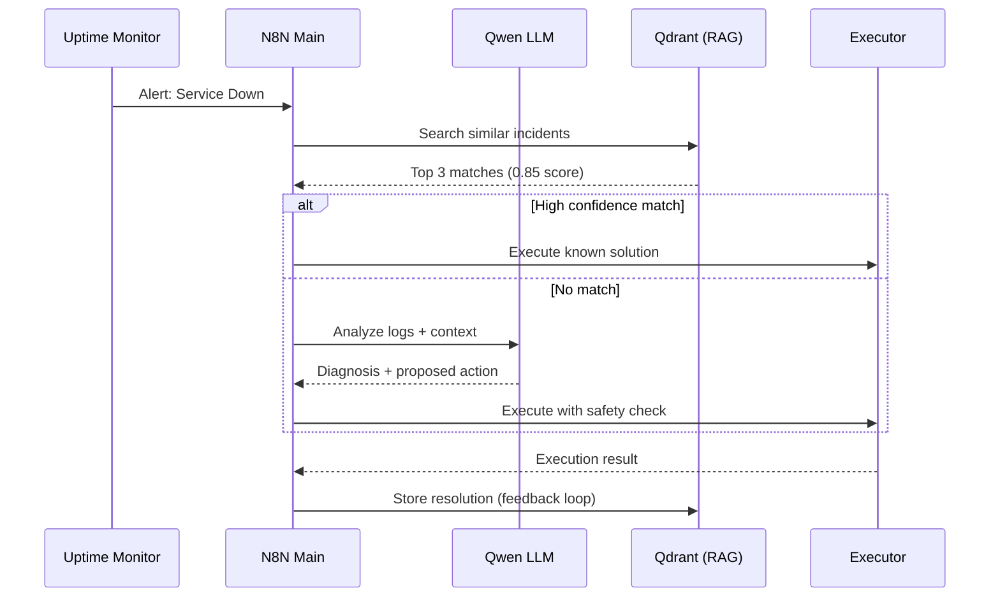

# Architecture Documentation

## System Overview

The Local LLM Automation Stack is designed around three core principles:

1. **Data Sovereignty** - All AI inference happens locally
2. **Distributed Execution** - N8N queue mode for scalability
3. **AI-First Integration** - MCP as the bridge between AI and infrastructure

---

## Component Architecture

### 1. N8N Orchestration Layer

**Mode:** Queue-based distributed execution

```
┌─────────────────────────────────────────┐
│         N8N Main Instance               │
│  • Web UI (Port 5678)                   │
│  • Webhook receiver                     │
│  • Workflow editor                      │
└──────────────┬──────────────────────────┘
               │
               ▼
┌─────────────────────────────────────────┐
│         Redis Queue                     │
│  • Task distribution                    │
│  • Worker coordination                  │
└──────────┬───────────────┬──────────────┘
           │               │
    ┌──────▼─────┐  ┌─────▼──────┐
    │  Worker 1  │  │  Worker 2  │
    │  (Exec)    │  │  (Exec)    │
    └────────────┘  └────────────┘
```

**Benefits:**
- Horizontal scaling
- Fault tolerance
- Load distribution

---

### 2. AI Inference Layer

**Ollama Server** acts as the local LLM gateway:

```
┌─────────────────────────────────────────┐
│         Ollama Server                   │
│  • Port: 11434                          │
│  • API: OpenAI-compatible               │
└──────────┬──────────────────────────────┘
           │
    ┌──────┴────────┬──────────┬──────────┐
    │               │          │          │
┌───▼────┐  ┌──────▼─────┐ ┌──▼─────┐ ┌──▼──────┐
│ Qwen   │  │  Mistral   │ │ LLaVA  │ │ Nomic   │
│ 2.5    │  │  7B        │ │ Vision │ │ Embed   │
│ 3B     │  │            │ │        │ │         │
└────────┘  └────────────┘ └────────┘ └─────────┘
```

**Model Selection:**
- **Qwen 2.5 Coder 3B**: Primary orchestration agent (CPU-optimized)
- **Mistral 7B**: General-purpose reasoning
- **LLaVA 7B**: Multimodal (vision + text)
- **Nomic Embed**: Text embeddings for RAG

---

### 3. Data Layer

**PostgreSQL** - Workflow state persistence
- N8N execution history
- Workflow definitions
- User data

**Qdrant** - Vector database for RAG
- Incident embeddings
- Semantic search
- Knowledge base retrieval

```
┌──────────────────┐      ┌──────────────────┐
│   PostgreSQL     │      │     Qdrant       │
│                  │      │                  │
│  • Workflows     │      │  • Embeddings    │
│  • Executions    │      │  • Collections   │
│  • User Data     │      │  • Metadata      │
└──────────────────┘      └──────────────────┘
```

---

## Model Context Protocol (MCP) Integration

### Local MCP Servers (Qwen Agent)

```
┌─────────────────────────────────────────┐
│     Qwen 2.5 Orchestrator Agent         │
└──────────────┬──────────────────────────┘
               │
    ┌──────────┼──────────┬────────────┐
    │          │          │            │
┌───▼────┐ ┌──▼──────┐ ┌─▼────────┐ ┌─▼─────┐
│Memory  │ │Sequential│ │Filesystem│ │ N8N   │
│ MCP    │ │Thinking  │ │  MCP     │ │ MCP   │
└────────┘ └──────────┘ └──────────┘ └───────┘
```

**Purpose:**
- Knowledge graph (Memory MCP)
- Complex reasoning (Sequential Thinking MCP)
- File operations (Filesystem MCP)
- Workflow automation (N8N MCP)

### Remote MCP Wrapper (Claude Desktop → VPS)

```
┌──────────────────┐        SSH         ┌──────────────────┐
│ Claude Desktop   │ ──────────────────► │   VPS Server     │
│ (Windows/Mac)    │      over TLS       │                  │
│                  │                     │  MCP Wrapper     │
│  • execute_cmd   │◄────────────────────│  • Validates     │
│  • monitor       │      JSON-RPC       │  • Sandboxes     │
│  • diagnose      │                     │  • Executes      │
└──────────────────┘                     └──────────────────┘
```

**Security:**
- SSH key authentication only
- Command whitelist validation
- Sandboxed execution environment

---

## Workflow Execution Flow

### Example: Auto-Healing Incident



---

## Security Architecture

### Network Hardening

```
Internet
    │
    ▼
┌─────────────────────────────────────────┐
│         UFW Firewall                    │
│  • Port 22  (SSH - Keyed Only)          │
│  • Port 80  (HTTP - N8N Webhooks)       │
│  • Port 443 (HTTPS - N8N UI)            │
│  • DROP All Other                       │
└──────────────┬──────────────────────────┘
               │
    ┌──────────┼────────────┐
    │          │            │
┌───▼────┐ ┌──▼──────┐ ┌───▼────────┐
│ SSH    │ │ Fail2Ban│ │ Docker     │
│ Config │ │  IDS    │ │ Isolation  │
└────────┘ └─────────┘ └────────────┘
```

**Layers:**
1. **UFW**: Port-level filtering
2. **Fail2Ban**: Brute-force protection
3. **SSH**: Key-only authentication + custom port
4. **Docker**: Network isolation between services

---

## Backup Strategy

### Daily Automated Backups

```
03:00 AM Daily
    │
    ▼
┌─────────────────────────────────────────┐
│    PostgreSQL Dump                      │
│  • Full database export                 │
│  • Gzip compression                     │
└──────────────┬──────────────────────────┘
               │
    ┌──────────▼────────────┐
    │ /opt/backups/postgres │
    │  • 7-day rotation     │
    │  • Auto-cleanup       │
    └───────────────────────┘
```

**Recovery:**
```bash
gunzip -c backup.sql.gz | docker exec -i postgres psql -U user -d db
```

---

## Resource Allocation

### Production Deployment

| Service | CPU | RAM | Storage | Network |
|---------|-----|-----|---------|---------|
| N8N Main | 2 cores | 4 GB | 20 GB | 1 Gbps |
| N8N Worker 1 | 2 cores | 4 GB | - | 1 Gbps |
| N8N Worker 2 | 2 cores | 4 GB | - | 1 Gbps |
| Ollama | 4 cores | 16 GB | 50 GB | - |
| PostgreSQL | 1 core | 4 GB | 100 GB | - |
| Qdrant | 1 core | 8 GB | 50 GB | - |
| Redis | 1 core | 2 GB | 5 GB | - |

**Total:** 12 vCPUs, 45 GB RAM, 300 GB Storage

---

## Scaling Considerations

### Horizontal Scaling (Workers)
Add more N8N workers for increased throughput:
```bash
docker-compose up -d --scale n8n-worker=4
```

### Vertical Scaling (Ollama)
Upgrade to GPU instance for faster inference:
- RTX 3090: ~4x speedup for Qwen 3B
- A100 40GB: 10x+ speedup, larger models supported

### Database Replication
For high availability:
- PostgreSQL streaming replication
- Qdrant cluster mode (3+ nodes)

---

## Monitoring & Observability

**Recommended Tools:**
- **Netdata**: Real-time metrics
- **Grafana + Loki**: Log aggregation
- **Uptime Kuma**: Service health checks

**Key Metrics:**
- N8N workflow success rate
- Ollama inference latency (tokens/sec)
- PostgreSQL connection pool usage
- Redis queue depth

---

## Next Steps

1. Review [MCP-GUIDE.md](./MCP-GUIDE.md) for remote access setup
2. Check [SECURITY.md](./SECURITY.md) for hardening procedures
3. Explore [examples/workflows/](./examples/workflows/) for ready-to-use automations
