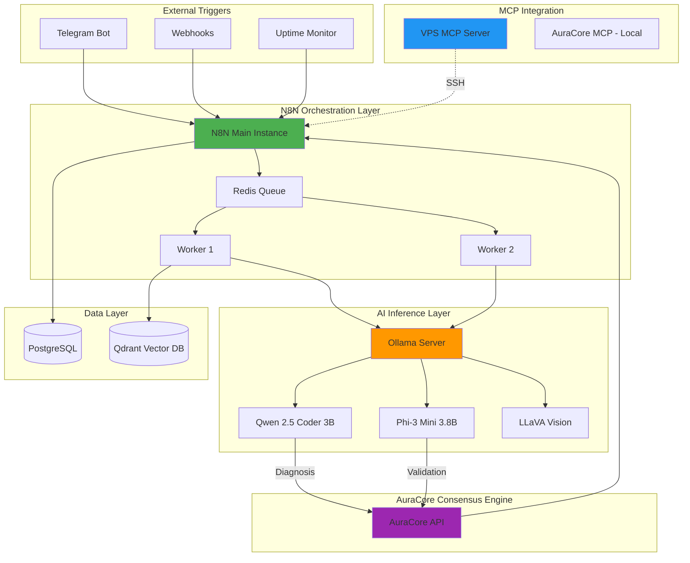

# Local LLM Automation Stack

> **Production-Ready Infrastructure Template for Self-Hosted AI Agents**

Deploy autonomous AI workflows with N8N orchestration, local LLMs (Ollama/Qwen/Phi-3), vector storage (Qdrant), and Model Context Protocol (MCP) integration — all running on your own infrastructure.

[](https://opensource.org/licenses/MIT)
[](https://www.docker.com/)
[](https://modelcontextprotocol.io/)

---

## Key Features

### Data Sovereignty
- 100% local LLM inference (no cloud dependencies)
- Self-hosted vector database for embeddings
- On-premise workflow execution

### Cost Efficiency
- Zero API costs for inference (Ollama/Qwen/Phi-3)
- Predictable infrastructure expenses
- Scalable worker architecture

### Enterprise Security
- Hardened SSH configuration
- UFW firewall + Fail2Ban
- Command whitelisting for AI agents
- Automated security backups

---

## Architecture Overview



---

## AI Models

| Model | Size | Purpose |
|-------|------|--------|
| **Qwen 2.5 Coder 3B** | 1.9GB | Primary diagnostic LLM - analyzes logs, errors, infrastructure issues |
| **Phi-3 Mini 3.8B** | 2.2GB | Validation LLM - validates Qwen's diagnoses for consensus decisions |
| **LLaVA** | 4.7GB | Vision model for screenshot/image analysis |

### Consensus Engine (Double LLM Validation)

For critical infrastructure decisions, AuraCore uses a **dual-LLM consensus system**:

1. **Qwen** analyzes the incident and proposes diagnosis + action
2. **Phi-3** validates the diagnosis independently
3. **Consensus computed**: AGREED / PARTIAL / DISAGREED
4. Auto-execution only if both LLMs agree with high confidence

See **[AURACORE-MCP.md](./AURACORE-MCP.md)** for full documentation.

---

## N8N Queue Mode
- Distributed execution with Redis-backed queue
- Horizontal scaling with multiple workers
- PostgreSQL for workflow persistence

## Vector Memory (RAG)
- Qdrant vector database for embeddings
- Semantic search for incident history
- Persistent knowledge base

## MCP Integration

### VPS MCP Server (Remote Control)
Control your infrastructure from Claude Desktop:
- `execute_command` - Run SSH commands
- `list_docker_containers` - Monitor containers
- `check_docker_logs` - Debug services
- `restart_docker_container` - Restart services
- `check_system_resources` - Monitor CPU/RAM
- `diagnose_vps` - Full system health check
- `query_postgres` - Database queries

### AuraCore MCP (Local - Claude Desktop)
Project and context management for AI agents:
- Project management (create, list, update)
- Context storage (business rules, patterns, conventions)
- Task tracking with priorities and dependencies
- Session memory (key-value store with TTL)
- Decision logging (anti-hallucination audit trail)

See **[AURACORE-MCP.md](./AURACORE-MCP.md)** for full AuraCore documentation.

---

## Tech Stack

| Component | Technology | Purpose |
|-----------|-----------|---------|
| **Orchestration** | N8N (Queue Mode) | Workflow automation |
| **LLM Inference** | Ollama + Qwen 2.5 + Phi-3 | Local AI reasoning + validation |
| **Consensus** | AuraCore API | Double LLM validation |
| **Vector DB** | Qdrant | Semantic search & RAG |
| **Database** | PostgreSQL 16 | Workflow persistence |
| **Queue** | Redis 7 | Distributed task queue |
| **MCP** | Model Context Protocol | AI-system integration |
| **Security** | UFW + Fail2Ban | Network hardening |

---

## System Requirements

**Minimum:**
- 8 vCPUs
- 32 GB RAM
- 100 GB SSD
- Debian 11+ / Ubuntu 22.04+

**Recommended (Production):**
- 12 vCPUs
- 45 GB RAM
- 300 GB SSD
- Dedicated backup storage

---

## Quick Start

### 1. Clone the Repository
```bash
git clone https://github.com/AuraStackAI-Agency/VPS-debian.git
cd VPS-debian
```

### 2. Configure Environment
```bash
cp examples/.env.example .env
nano .env
```

### 3. Deploy the Stack
```bash
docker-compose -f examples/docker-compose.example.yml up -d
```

### 4. Pull LLM Models
```bash
ollama pull qwen2.5-coder:3b-instruct-q4_K_M
ollama pull phi3:mini
```

---

## Documentation

- **[AURACORE-MCP.md](./AURACORE-MCP.md)** - AuraCore MCP Server documentation
- **[MCP-GUIDE.md](./MCP-GUIDE.md)** - VPS MCP integration guide
- **[ARCHITECTURE.md](./ARCHITECTURE.md)** - Detailed system design
- **[SECURITY.md](./SECURITY.md)** - Security hardening guide

---

## License

MIT License - see [LICENSE](./LICENSE)

---

**Built with care for AI Infrastructure**
