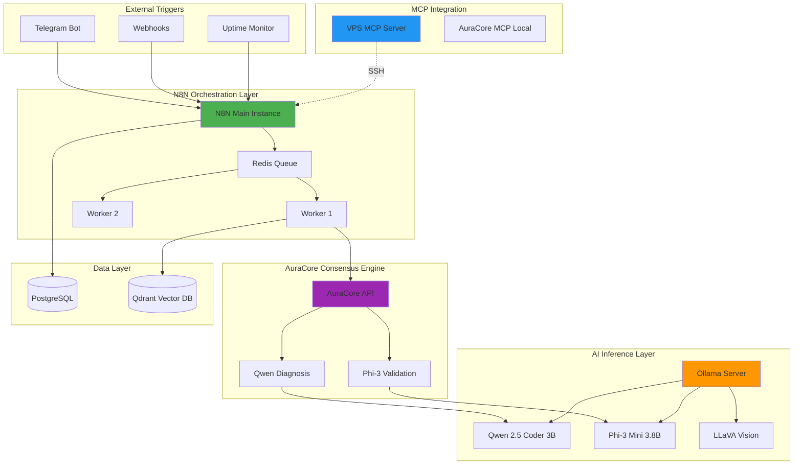

# Local LLM Automation Stack

> **Production-Ready Infrastructure Template for Self-Hosted AI Agents**

Deploy autonomous AI workflows with N8N orchestration, local LLMs (Ollama/Qwen/Phi-3), vector storage (Qdrant), and Model Context Protocol (MCP) integration — all running on your own infrastructure.

[](https://opensource.org/licenses/MIT)
[](https://www.docker.com/)
[](https://modelcontextprotocol.io/)

---

## 🎯 Why This Stack?

### Data Sovereignty
- 100% local LLM inference (no cloud dependencies)
- Self-hosted vector database for embeddings
- On-premise workflow execution

### Cost Efficiency
- Zero API costs for inference (Ollama/Qwen/Phi-3)
- Predictable infrastructure expenses
- Scalable worker architecture

### Enterprise Security
- Hardened SSH configuration
- UFW firewall + Fail2Ban
- Command whitelisting for AI agents
- Automated security backups

---

## 🏗️ Architecture Overview



---

## ✨ Key Features

### 🔄 N8N Queue Mode
- Distributed execution with Redis-backed queue
- Horizontal scaling with multiple workers
- PostgreSQL for workflow persistence

### 🤖 Local LLM Inference (Dual Model)
- **Qwen 2.5 Coder 3B** - Primary diagnostic model (code-optimized)
- **Phi-3 Mini 3.8B** - Validation model (reasoning-optimized)
- CPU-optimized for cost-effective deployment
- No external API dependencies

### 🧠 AuraCore Consensus Engine
- Dual-LLM validation for infrastructure decisions
- JSON-structured communication between models
- Confidence scoring and risk assessment
- Auto-execute safe actions, escalate risky ones

### 🧠 Vector Memory (RAG)
- Qdrant vector database for embeddings
- Semantic search for incident history
- Persistent knowledge base

### 🔌 Model Context Protocol (MCP)
- Remote VPS control from Claude Desktop
- Local MCP servers for AI agents
- N8N workflow automation via MCP
- **AuraCore MCP** for project/context management

### 🛡️ Security Hardening
- Automated security setup script
- UFW firewall configuration
- Fail2Ban intrusion prevention
- SSH key-only authentication

### 💾 Automated Backups
- Daily PostgreSQL dumps
- 7-day retention policy
- Configurable backup rotation

---

## 🚀 Quick Start

### Prerequisites
- Debian/Ubuntu server (12 vCPUs, 45GB RAM recommended)
- Docker & Docker Compose installed
- SSH access with key authentication

### 1. Clone the Repository
```bash
git clone https://github.com/AuraStackAI-Agency/VPS-debian.git
cd VPS-debian
```

### 2. Configure Environment
```bash
cp examples/.env.example .env
# Edit .env with your configuration
nano .env
```

### 3. Deploy the Stack
```bash
docker-compose -f examples/docker-compose.example.yml up -d
```

### 4. Apply Security Hardening
```bash
chmod +x scripts/harden_vps.sh
sudo ./scripts/harden_vps.sh
```

### 5. Setup Automated Backups
```bash
chmod +x scripts/setup_automated_backups.sh
sudo ./scripts/setup_automated_backups.sh
```

---

## 📚 Documentation

- **[Architecture Deep Dive](./ARCHITECTURE.md)** - Detailed system design
- **[MCP Integration Guide](./MCP-GUIDE.md)** - Remote VPS control from Claude Desktop
- **[AuraCore MCP Guide](./AURACORE-MCP.md)** - Project & context management for AI agents
- **[Security Hardening](./SECURITY.md)** - Best practices and configuration
- **[Example Workflows](./examples/workflows/)** - Ready-to-use N8N workflows

---

## 🎯 Use Cases

### 1. **Self-Healing Infrastructure**
Autonomous incident detection and resolution using dual-LLM consensus with human-in-the-loop validation.

### 2. **Voice-Enabled Customer Audits**
Telegram-based conversational audits with STT (Faster-Whisper) + LLM analysis.

### 3. **Document Processing Pipeline**
PDF invoice extraction with local LLM parsing and PostgreSQL storage (100% GDPR compliant).

---

## 🔌 MCP Integration Highlights

Control your entire infrastructure from **Claude Desktop** via Model Context Protocol:

**VPS MCP Tools:**
- `execute_command` - Run SSH commands
- `list_docker_containers` - Monitor containers
- `check_docker_logs` - Debug services
- `restart_docker_container` - Restart services
- `check_system_resources` - Monitor CPU/RAM
- `diagnose_vps` - Full system health check
- `query_postgres` - Database queries

**AuraCore MCP Tools:** (see [AURACORE-MCP.md](./AURACORE-MCP.md))
- Project management (create, list, update)
- Context storage (business rules, patterns, conventions)
- Task management with dependencies
- Session memory (remember/recall)
- Decision logging for traceability

👉 **[Full MCP Setup Guide](./MCP-GUIDE.md)**

---

## 🛠️ Tech Stack

| Component | Technology | Purpose |
|-----------|-----------|---------|
| **Orchestration** | N8N (Queue Mode) | Workflow automation |
| **LLM Inference** | Ollama + Qwen 2.5 + Phi-3 | Local AI reasoning |
| **Consensus** | AuraCore API | Dual-LLM validation |
| **Vector DB** | Qdrant | Semantic search & RAG |
| **Database** | PostgreSQL 16 | Workflow persistence |
| **Queue** | Redis 7 | Distributed task queue |
| **MCP** | Model Context Protocol | AI-system integration |
| **Security** | UFW + Fail2Ban | Network hardening |

---

## 📊 System Requirements

**Minimum:**
- 8 vCPUs
- 32 GB RAM
- 100 GB SSD
- Debian 11+ / Ubuntu 22.04+

**Recommended (Production):**
- 12 vCPUs
- 45 GB RAM
- 300 GB SSD
- Dedicated backup storage

---

## 🤝 Contributing

Contributions are welcome! Please read [CONTRIBUTING.md](./CONTRIBUTING.md) for details.

---

## 📄 License

This project is licensed under the MIT License - see the [LICENSE](./LICENSE) file for details.

---

## 🔗 Resources

- [N8N Documentation](https://docs.n8n.io/)
- [Ollama Models](https://ollama.ai/library)
- [Model Context Protocol](https://modelcontextprotocol.io/)
- [Qdrant Vector Database](https://qdrant.tech/)

---

**Built with ❤️ for AI Infrastructure Enthusiasts**

> Want to discuss advanced use cases? Open an issue or start a discussion!
